# Abstract

Marketing Mix Models (MMM) are powerful analytical models that help businesses optimize marketing budgets despite uncertainty coming from an increasingly complex marketing ecosystem where privacy regulations, incomplete tracking data, economic fluctuations, platform-level black boxes, and dynamically changing consumer behavior create large gaps in visibility. According to an Emarketer survey of 196 marketing professionals in the US in 2025 (Wood 2025), "nearly half (46.9%) of US brand and agency marketers plan to invest in marketing mix modeling (MMM) over the next year." 

MMM has evolved from its roots in econometrics and time-series analysis into a sophisticated discipline that blends marketing theory with advanced statistical modeling (Hansens & Dekimpe 2023). Early MMMs relied on simple linear regressions to estimate channel effects, but progress in Bayesian inference and computation has driven a transition toward Bayesian models capable of capturing uncertainty, heterogeneity, and nonlinear effects such as adstock and saturation (Jin, Wang, Sun, Chan, Koehler 2017). Recent industry developments include unified measurement across marketing channels, feature selection, and open-source MMM solutions. 

While open-source MMMs democratize marketing mix modeling, their simplicity and abstraction can encourage users to treat them as a 'plug-and-play' tool, overlooking the underlying causal dependencies between marketing channels (e.g., treating intermediate variables such as branded search as independent drivers). In this paper, we demonstrate how ignoring causal dependencies can severely bias parameter estimates, and then we correct these biases through carefully chosen priors. Additionally, we show that causally accurate, yet overly complex models can also bias parameter estimates. Finally, we discuss promising directions for addressing these challenges.

# Introduction

The rest of this paper is organized as follows. In the [Background](#background) section, we discuss the history of Bayesian MMMs, how to code a Bayesian MMM in Python, and then the core issue of ignoring causal structure for funnel effects. In the [Methodology](#methodology) section, we explain our data generating process where the simulated data has upper funnel channel impacts on lower funnel channels. From there, we show how we set up different MMMs to retrieve our parameters. In the [Results](#results) section, we see that better priors improve parameter recovery, while overly complex models worsen parameter recovery. In the [Conclusion](#conclusion) section, we summarize results and briefly discuss future developments. 

# Background

MMM research started primarily in the 1960s-1970s as scholars and practicioners sought to understand how product, price, promotion, and distribution interact and influence performance (Borden, 1964; McCarthy, 1978). Early models used aggregate data in regression-based frameworks. Bayesian approaches to MMM gained momentum in the late 2010s thanks to advances in sampling computation and newer research including key research from Google on carryover and shape effects (Jin, Wang, Sun, Chan, Koehler 2017) as well as hierarchical modeling (Sun, Wang, Jin, Chan, Koehler 2016). Bayesian MMMs help mitigate issues with multicollinearity, small data but high parameters, and uncertainty propogation. 

The next sub-sections demonstrates the development from Bayesian Linear Regression to Bayesian MMMs:

## Bayesian Linear Regression

Bayesian linear regression extends the traditional linear regression algorithm by modeling uncertainty in the estimated coefficients through probability distributions. The formula for the algorithm is the same where the expected value of the response variable $y_i$ is a linear combination of predictors:

$$ E(y_i|\beta, X) = \beta_1 x_{i1} + ... + \beta_k x_{ik} $$

The response $y_i$ is assumed to follow a normal distribution centered around the linear predictor, with variance $\sigma^2$. 

$$ y_i \sim N(X_i^T \beta, \sigma^2) $$

Here's an example implementation in PyMC code modeling marketing spend's effect on sales:

```python
with pm.Model() as model:

    #Priors
    beta_0 = pm.Normal('beta_0',0, sigma=10000) # intercept
    beta_1 = pm.HalfNormal('beta_1', sigma=10) # slope
    sigma = pm.HalfNormal('sigma', sigma=4000) # standard deviation - expect sales to vary by 4000

    # Deterministics
    mu = beta_0 + beta_1*spend # intercept + Beta*spend

    # Likelihood
    Ylikelihood = pm.Normal('Ylikelihood', mu, sigma, observed=sales)
```

The difference between linear regression and Bayesian linear regression is how uncertainty is modeled. In the above code example, instead of producing a point estimate for $\beta_1$ (spend's effect on sales), the Bayesian linear regression model treats the $\beta_1$ as a half normal random variable and specifies a prior belief about the $\beta_1$ (uninformative prior with wide variance of 10 that is expected to be positive and closer to 0). Priors are also placed on the intercept $\beta_0$ and the variance $\sigma$. 

Bayesian linear regression inherits the core advantages of Bayesian inference, such as the ability to express results in probabilistic terms (e.g., a 95% probability that a coefficient lies within a certain range) rather than in terms of confidence intervals (if I run the regression many times on new random samples, 95% of the output confidence intervals will contain the true value). Additionally, priors allow the model to incorporate prior knowledge or domain expertise, which can stabilize coefficient estimates and reduce overfitting. This is particularly valuable in cases with limited data, high multicollinearity, or sparse predictors.

Sadly, Bayesian linear regression also comes with challenges. One key issue is prior sensitivity: the choice of priors can heavily influence the posterior results, especially when data are limited. Priors that are too strong may bias results toward preconceived beliefs, while those that are too weak may fail to regularize effectively. Computational cost is another challenge. When conjugate priors are not available, inference requires sampling methods such as Markov Chain Monte Carlo (MCMC), which is significantly slower than the closed-form ordinary least squares (OLS) solution used in traditional regression. Finally, in large datasets, both methods' estimates often converge. Because the influence of priors diminishes with abundant data, a linear regression model is just as accurate, yet faster than Bayesian linear regression in this situation.

## Bayesian MMM

Bayesian MMM adds some marketing specific adjustments to Bayesian Linear regression models: 

$$ y_t = \sum_{i=1}^m \beta_i s_i(c_i(x_{t-l+1,i},...,x_{t,i}; \alpha_i); k_i, \lambda_i) + \sum_{j=1}^n \gamma_j z_{t,j} + \epsilon_t $$

The $s_i$ and $c_i$ are the shape and carryover transformations (Jin, Wang, Sun, Chan, & Koehler 2017), and the $\gamma_j$ are control variables. The shape transformation models the diminishing returns of advertising: as an audience continues to see ads and starts to convert, eventually there's less and less audience to convert. Meanwhile, the carryover tranformation models the delayed effect of advertising. Lastly, the control variables help account for known confounders.

Here's the implementation:

```python
with pm.Model() as model:

    # ----------------------
    # Priors
    # ----------------------
    beta_x0 = pm.Normal("beta_x0", 0.5, sigma=0.2)          # intercept
    beta_t = pm.HalfNormal("beta_t", sigma=0.02)        # trend slope

    # Media spend coefficients
    beta_x1 = pm.HalfNormal("beta_x1", sigma=0.5)
    beta_x2 = pm.HalfNormal("beta_x2", sigma=0.5)

    # Seasonality - Fourier terms 
    beta_fourier = pm.Laplace("beta_fourier", mu=0.0, b=0.2, shape=fourier_terms.shape[1])

    # Control events
    gamma_control1 = pm.Normal("gamma_control1", 0, 0.05)
    gamma_control2 = pm.Normal("gamma_control2", 0, 0.05)

    # Noise
    sigma = pm.HalfNormal("sigma", sigma=2)

    # Adstock and saturation priors
    adstock_alpha1 = pm.Beta("adstock_alpha1", alpha=2, beta=2)
    saturation_lam1 = pm.Gamma("saturation_lam1", alpha=3, beta=1)
    saturation_beta1 = pm.HalfNormal("saturation_beta1", sigma=2)

    adstock_alpha2 = pm.Beta("adstock_alpha2", alpha=2, beta=2)
    saturation_lam2 = pm.Gamma("saturation_lam2", alpha=3, beta=1)
    saturation_beta2 = pm.HalfNormal("saturation_beta2", sigma=2)

    # ----------------------
    # Forward pass (applies the transformations)
    # ----------------------
    x1_transformed = pm.Deterministic(
        "x1_transformed",
        forward_pass(scaled_data['x1'].values, adstock_alpha1, saturation_lam1, saturation_beta1)
    )

    x2_transformed = pm.Deterministic(
        "x2_transformed",
        forward_pass(scaled_data['x2'].values, adstock_alpha2, saturation_lam2, saturation_beta2)
    )
    
    # ----------------------
    # Deterministic Variables (can pull these from model later for reporting)
    # ----------------------
    channel1_contribution = pm.Deterministic("channel1_contribution", beta_x1 * x1_transformed)
    channel2_contribution = pm.Deterministic("channel2_contribution", beta_x2 * x2_transformed)
    fourier_contribution = pm.Deterministic("fourier_contribution", pm.math.dot(fourier_terms, beta_fourier))
    trend_contribution = pm.Deterministic("trend_contribution", beta_t * scaled_data['t'].values)
    control1_contribution = pm.Deterministic("control1_contribution", gamma_control1 * scaled_data['event_1'].values)
    control2_contribution = pm.Deterministic("control2_contribution", gamma_control2 * scaled_data['event_2'].values)

    # ----------------------
    # Expected value of outcome
    # ----------------------
    mu = pm.Deterministic(
        "mu",
        beta_x0
        + channel1_contribution
        + channel2_contribution
        + fourier_contribution
        + trend_contribution
        + control1_contribution
        + control2_contribution
    )

    # Likelihood
    Ylikelihood = pm.Normal("Ylikelihood", mu, sigma, observed=scaled_data['y'].values)
```

Unlike in regular MMMs, the shape and carryover parameters are random variables with probability distributions, and priors can be set for these parameters. Prior knowledge or domain expertise can be used to create very useful carryover and shape priors that improve model accuracy. For example, time to conversion estimates pulled from marketing attribution data can be used to estimate carryover priors. Similarly, ROAS estimates at different level of spends can be used to estimate shape priors. Or, domain experts can help provide simple priors. 

## Funnel Effects

One issue in regular MMMs that Bayesian MMMs might be able to mitigate is the issue of funnel effects (Chan and Perry 2017). Funnel effects are biases that occur when marketing channels influence one another across stages of the customer journey—where upper-funnel activities affect both lower-funnel channels and final outcomes. For instance, a linear TV ad may increase paid search volume as well as directly drive sales. In this case, TV ads impact sales both directly and indirectly, but naive MMMs that assume independence between TV and search fail to capture this causal structure. 

# Methodology

With smarter priors or with causally accurate modeling, the Bayesian MMM should be able to better handle these funnel effects.

We start with a simple premise - paid search is an intermediary lower funnel channel:
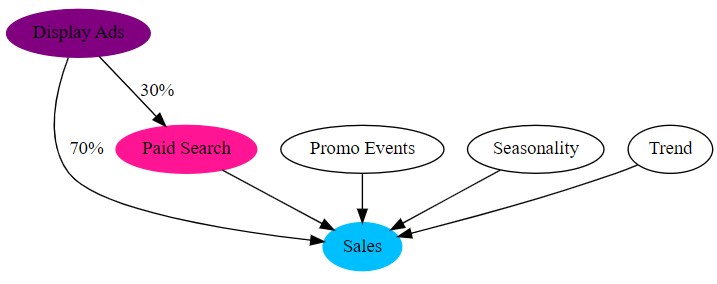

We will investigate how bad ignoring this causality can be for MMMs using simulated data that reflects this real world causality. Because the data is simulated, we will know the true parameters. A good MMM should be able to recover these true parameters. 

## Data Generating Process

In our generated data, 70% of display ads impressions flows directly to sales, while 30% flow to paid search. Thus, there are three impacts:

* Display ads direct impact on sales.
* Display and search ads combined impact sales.
* Search ads direct impact on sales.

The data generating process is as follows:

1. Generate 105 weeks (about 2 years).
2. Add in the media spends for display and search. Display ads will have more spends since most companies would spend more in upper funnel marketing channels. 

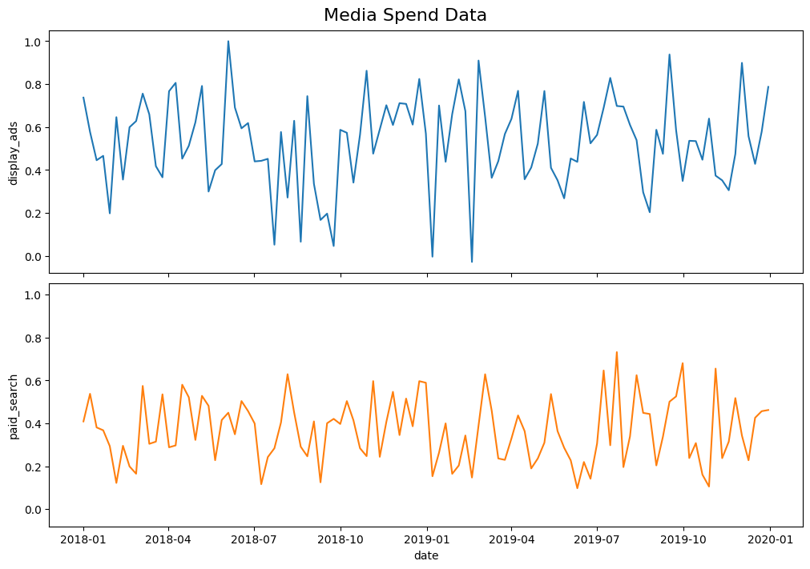

3. Apply a carryover transformation to the spends.

- Display $\alpha$ = 0.4
- Search $\alpha$ = 0.2
- Display has a stronger carryover effect. 

4. Apply a saturation transformation to the spends.

- Display $\lambda$ = 4
- Search $\lambda$ = 2
- Display saturates faster because it is a demand creation channel that builds awareness but quickly reaches the same audience with repeated impressions. Meanwhile, paid search is a demand capture channel. Because users are actively searching for related terms, each incremental dollar can often reach new high-intent users - up to a point. 


5. Add seasonality and trend.


6. Add two big promotional events on May 13, 2018 and September 14, 2019.

7. Combine all of these to generate simulated sales.

$$
Sales_t \sim \mathcal{N}(\mu_t, \sigma) \\
$$

$$
\mu_t = \alpha + \beta_1 \cdot \text{DisplayDirect}_t + \beta_2 \cdot \text{DisplayAndSearch}_t + \beta_3 \cdot \text{SearchDirect}_t + \text{Fourier}_t \cdot \beta_{\text{fourier}} + \beta_t \cdot trend + \gamma_1 \cdot \text{Event1}_t + \gamma_2 \cdot \text{Event2}_t
$$

Code:

```python
df["intercept"] = 1
df["epsilon"] = rng.normal(loc=0.0, scale=0.25, size=n)

amplitude = 1
beta_1 = 3.0 # display direct
beta_2 = 4.0 # let's assume that being touched by both display and search increases a customer's chance to convert by a decent amount - keep in mind this costs more too
beta_3 = 2.0 # search direct
betas = [beta_1, beta_2, beta_3]
proportion_display_to_search = 0.30 # 30% of impressions from display are funneled to search

df['display_ads_adstock_saturated_direct'] = df['display_ads_adstock_saturated'] * (1 - proportion_display_to_search)
df['display_search_adstock_saturated'] = df['display_ads_adstock_saturated'] * (proportion_display_to_search)
df['paid_search_adstock_saturated_direct'] = df['paid_search_adstock_saturated'] - df['display_search_adstock_saturated']

df["y"] = amplitude * (
    df["intercept"]
    + beta_1 * df['display_ads_adstock_saturated_direct']
    + beta_2 * df['display_search_adstock_saturated']
    + beta_3 * df['paid_search_adstock_saturated_direct']
    + df["seasonality"]
    + df["trend"]
    + 1.5 * df["event_1"]
    + 2.5 * df["event_2"]
    + df["epsilon"] # this is the sigma
)
```

When we model, we will assume we don't know this 70/30 split and use the model to recover it; the data fed to the model will only have display impressions and search impressions. Additionally, we will try to correctly recover the adstock, saturation, and contribution parameters.

Here's the contribution parameters we want to recover:

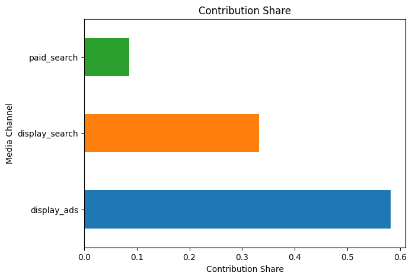

Here's the ROAS we want to recover:


## Naive Model 

First, we will build a naive MMM (replicating base model frameworks that we see in [PyMC Marketing](https://www.pymc-marketing.io/en/latest/)) and see how close it can get to the true parameters.

Here's an example of PyMC's base model framework:


In this above framework, marketing channels are treated independently.

$$
Sales_t \sim \mathcal{N}(\mu_t, \sigma)
$$

$$
\mu_t = \alpha + \beta_1 \cdot \text{Display}_t + \beta_2 \cdot \text{Search}_t + \text{Fourier}_t \cdot \beta_{\text{fourier}} + \beta_t \cdot trend + \gamma_1 \cdot \text{Event1}_t + \gamma_2 \cdot \text{Event2}_t
$$

```python
    mu = pm.Deterministic(
        "mu",
        alpha
        + display_contribution
        + search_contribution
        + fourier_contribution
        + trend_contribution
        + control1_contribution
        + control2_contribution
    )
```

## Causal Model

From there, we will build a more causally accurate MMM and see how close it can get to the true parameters. 

$$
Sales_t \sim \mathcal{N}(\mu_t, \sigma)
$$

$$
\mu_t = \alpha + \beta_1 \cdot \text{DisplayDirect}_t + \beta_2 \cdot \text{DisplayAndSearch}_t + \beta_3 \cdot \text{SearchDirect}_t + \text{Fourier}_t \cdot \beta_{\text{fourier}} + \beta_t \cdot trend + \gamma_1 \cdot \text{Event1}_t + \gamma_2 \cdot \text{Event2}_t
$$

Where, on top of finding the $\beta$ coefficients, we also want to uncover the true proportion of display ads flowing into search:

$$
\pi \sim \text{Beta}(2, 2)
$$

Since $\pi$ is a proportion between 0 and 1, modeling it as a beta distribution is perfect.

$$
\text{DisplayAndSearch}_t = \pi \cdot \text{DisplayAds}_t
$$

$$
\text{DisplayDirect}_t = (1 - \pi) \cdot \text{TotalDisplayAds}_t
$$

$$
\text{SearchDirect}_t = \text{TotalPaidSearch}_t - \text{DisplayAndSearch}_t
$$


with these other priors (adjusted because y was scaled):

$$
\alpha \sim \mathcal{N}(0.5, 0.2)
$$

$$
\beta_t \sim \text{HalfNormal}(0.02)
$$

$$
\beta_{\text{fourier}} \sim \text{Laplace}(0, 0.2)
$$

$$
\gamma_1, \gamma_2 \sim \mathcal{N}(0, 0.05)
$$

$$
\beta_{\text{disp,dir}}, \beta_{\text{disp,search}}, \beta_{\text{search,dir}} \sim \text{HalfNormal}(0.5)
$$

$$
\sigma \sim \text{HalfNormal}(2)
$$

We will add some uncertainty to the $\text{DisplayAndSearch}_t$ by modeling it as a normal distribution and adding a search $\sigma$.

```python
with pm.Model() as model:
    # ----------------------
    # Data
    # ----------------------
    display_ads = pm.Data("display_ads", scaled_data["display_ads"].values)
    paid_search = pm.Data("paid_search", scaled_data["paid_search"].values)
    t = pm.Data('t', scaled_data["t"].values)
    event_1 = pm.Data('event1', scaled_data["event_1"].values)
    event_2 = pm.Data('event2', scaled_data["event_2"].values)
    y = pm.Data('y', scaled_data['y'].values)
    # ----------------------
    # Priors
    # ----------------------
    alpha = pm.Normal("alpha", 0.5, sigma=0.2)          # intercept
    beta_t = pm.HalfNormal("beta_t", sigma=0.1)        # trend slope
    # Fourier terms
    beta_fourier = pm.Laplace("beta_fourier", mu=0.0, b=0.2, shape=fourier_terms.shape[1])
    # Control events
    gamma_control1 = pm.Normal("gamma_control1", 0, 0.05)
    gamma_control2 = pm.Normal("gamma_control2", 0, 0.05)

    # adstock and saturation
    adstock_alpha1 = pm.Beta("adstock_alpha1", alpha=2, beta=2)
    saturation_lam1 = pm.Gamma("saturation_lam1", alpha=3, beta=1)
    saturation_beta1 = pm.HalfNormal("saturation_beta1", sigma=2)

    adstock_alpha2 = pm.Beta("adstock_alpha2", alpha=2, beta=2)
    saturation_lam2 = pm.Gamma("saturation_lam2", alpha=3, beta=1)
    saturation_beta2 = pm.HalfNormal("saturation_beta2", sigma=2)

    pi = pm.Beta("display_to_search_proportion", alpha=2, beta=2) # wide prior
    display_transformed = forward_pass(display_ads,  adstock_alpha1, saturation_lam1, saturation_beta1)
    search_transformed = forward_pass(paid_search, adstock_alpha2, saturation_lam2, saturation_beta2)

    # Mediator: Display → Search
    mu_ds = pi * display_transformed
    sigma_ds = pm.HalfNormal("sigma_ds", sigma=0.2)
    display_and_search = pm.Normal("display_and_search", mu=mu_ds, sigma=sigma_ds, shape=scaled_data['display_ads'].shape) # display and search is normally distributed with some random noise
    display_direct = display_transformed - display_and_search
    search_direct = search_transformed - display_and_search

    beta_display_direct = pm.HalfNormal("beta_display_direct", sigma=0.5)
    beta_display_and_search = pm.HalfNormal("beta_display_and_search", sigma=0.5)
    beta_search_direct = pm.HalfNormal("beta_search_direct", sigma=0.5)

    # Noise
    sigma = pm.HalfNormal("sigma", sigma=2)

    # combine everything to make mu of y
    display_direct_contribution = pm.Deterministic("display_direct_contribution", beta_display_direct * display_direct)
    display_and_search_contribution = pm.Deterministic("display_and_search_contribution", beta_display_and_search * display_and_search)
    search_direct_contribution = pm.Deterministic("search_direct_contribution", beta_search_direct * search_direct)
    fourier_contribution = pm.Deterministic("fourier_contribution", pm.math.dot(fourier_terms, beta_fourier))
    trend_contribution = pm.Deterministic("trend_contribution", beta_t * t)
    control1_contribution = pm.Deterministic("control1_contribution", gamma_control1 * event_1)
    control2_contribution = pm.Deterministic("control2_contribution", gamma_control2 * event_2)
    spend_display_direct = pm.Data("spend_display_direct", df["display_ads"].sum() * (1 - proportion_display_to_search))
    spend_display_search = pm.Data("spend_display_search", df["display_ads"].sum() * proportion_display_to_search)
    spend_search_direct = pm.Data("spend_search_direct", df["paid_search"].sum())

    contrib_display_direct = pm.Deterministic("contrib_display_direct", beta_display_direct * display_direct.sum())
    contrib_display_search = pm.Deterministic("contrib_display_search", beta_display_and_search * display_and_search.sum())
    contrib_search_direct = pm.Deterministic("contrib_search_direct", beta_search_direct * search_direct.sum())

    roas_1 = pm.Deterministic("roas_display_direct", contrib_display_direct / spend_display_direct)
    roas_2 = pm.Deterministic("roas_display_search", contrib_display_search / spend_display_search)
    roas_3 = pm.Deterministic("roas_search_direct", contrib_search_direct / spend_search_direct)


    mu = pm.Deterministic(
        "mu",
        alpha
        + display_direct_contribution
        + display_and_search_contribution
        + search_direct_contribution
        + fourier_contribution
        + trend_contribution
        + control1_contribution
        + control2_contribution
    )

    # Likelihood
    Ylikelihood = pm.Normal("Ylikelihood", mu, sigma, observed=y)
```

## Naive Model with Informed Priors

Lastly, we will examine if adding an incrementality estimate as a prior into the naive model can help improve parameter recovery.

Let's assume we had our display ads vendor run an A/B test in their platform using ghost bids to make a clean test vs. control comparison. The results are encoded as this prior (adjusted for scaling of y):

$$
\beta_{\text{display}} \sim \text{Normal}(.64, 0.1)
$$

# Results - Naive vs. Causal

## Model Fit

Both models fit the data rather well.

| Naive MMM | Causal MMM |
|:--------:|:--------:|
|  | 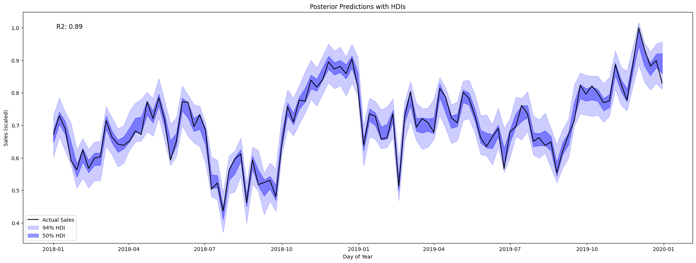 |

## Parameter Recovery

Both models struggled to recover adstock and saturation parameters. They had similar results.

| Naive MMM - Display | Causal MMM - Display |
|:--------:|:--------:|
|  | 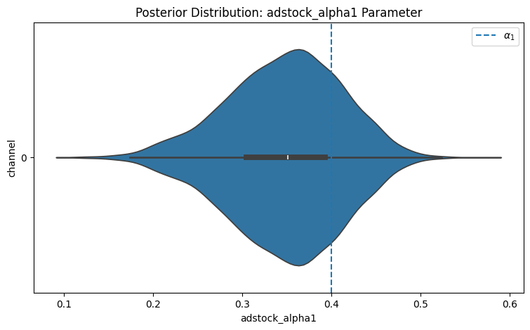 |

| Naive MMM - Display | Causal MMM - Display |
|:--------:|:--------:|
|  | 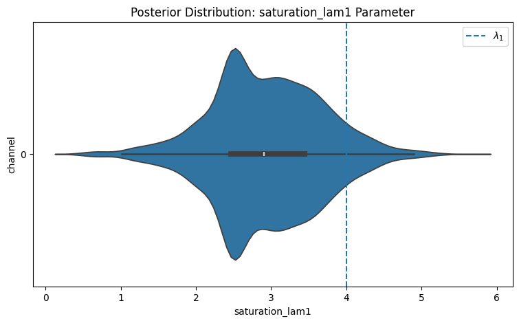 |

## Contribution Recovery

The naive model gave search too much credit. Some of that credit should have gone to display. Meanwhile, the causal MMM recovered the right direct search and display+search contributions albeit with very wide contribution intervals. 

| Naive MMM | Causal MMM |
|:--------:|:--------:|
|  | 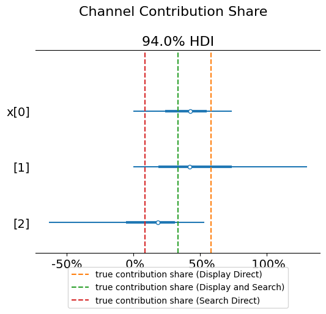 |

## Summary - Naive vs. Causal

The Causal MMM framework was too complex, leading to very wide parameter uncertainty. Maybe there's a smarter way to set up the model. This could be an avenue for future research.

The Naive MMM framework was too simple, giving too much credit to paid search. 

Let's now examine the results from using better priors for our Naive model.

# Results - Uninformed vs. Informed Priors in Naive Model

## Model Fit

The informed prior didn't really affect the model fit. 

| Uninformed | Informed |
|:--------:|:--------:|
|  | 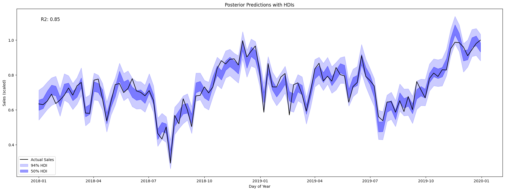 |

## Parameter Recovery

The informed prior model recovered the adstock parameter better. 

| Uninformed - Display | Informed - Display |
|:--------:|:--------:|
|  | 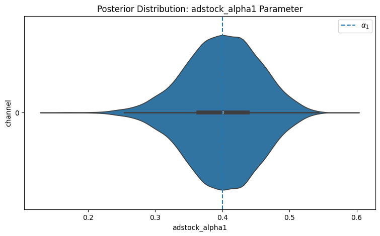 |

| Uninformed - Display | Informed - Display |
|:--------:|:--------:|
|  | 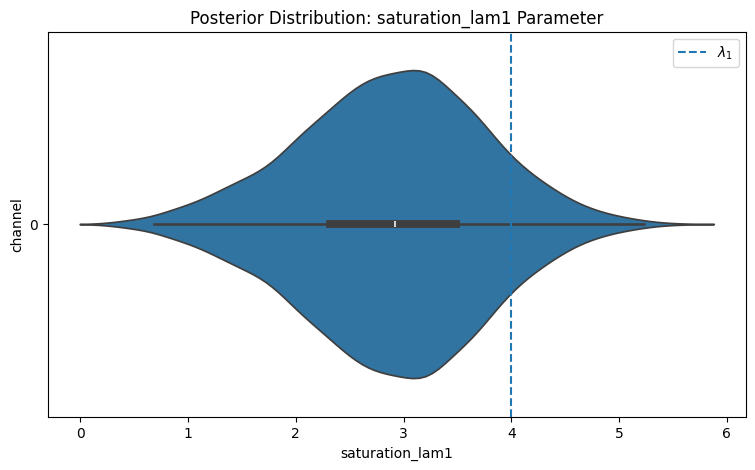 |

## Contribution Recovery

The informed prior model recovered the contributions better. 

| Uninformed | Informed |
|:--------:|:--------:|
|  | 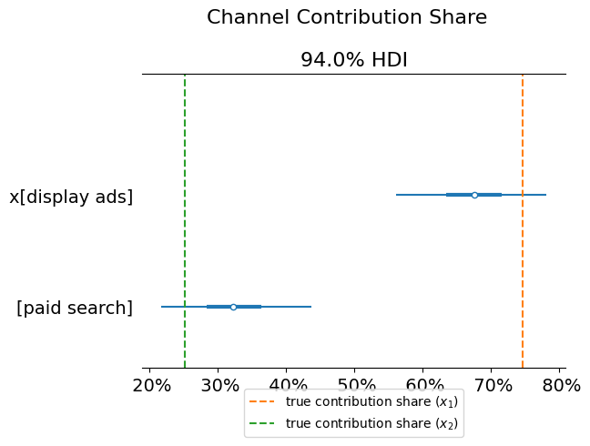 |

## Summary - Uninformed vs. Informed Priors

Adding an informed prior can help mitigate these funnel effect issues!

# Conclusion

From our analysis, we learned that naive MMMs will overcredit lower funnel channels, and informed priors can help mitigate funnel effect issues. 

Our causal MMM did not perform well. Future research could work on improving this model; however, solutions for these causal issues are already being implemented in industry and academia. In industry, Sellforte and Recast sell a causal MMM solution. For example, Recast's model has been developed based on this causal dag:


In academia, Chen, Chan, Koehler, Perry, Wang, Sun, and Jin (2018) correct for paid search bias in media mix modeling by adding a demand proxy control variable. Gong, Yao, Zhang, Chen, Li, Su, and Bi (2024) propose a novel MMM that estimates the causal structure automatically. Additionally, there are existing modeling frameworks such as Structural Equation Modeling, multi-stage approaches, and more advanced Bayesian models that express the causal model as a joint probability distribution. The future is bright for causally accurate MMMs. 

# References

- Borden, N. H. (1964). The concept of the marketing mix. Journal of advertising research, 4 (2),
2–7.
- Chen, A., Chan, D., Koehler, J., Perry, M., Wang, Y., Sun, Y., & Jin, Y. (2018). Bias correction for paid search in media mix modeling. Google Research. https://research.google/pubs/bias-correction-for-paid-search-in-media-mix-modeling/
- Gong, C., Yao, D., Zhang, L., Chen, S., Li, W., Su, Y., & Bi, J. (2024, March). Causalmmm: Learning causal structure for marketing mix modeling. In Proceedings of the 17th ACM International Conference on Web Search and Data Mining (pp. 238-246).
- Hanssens, D. M., & Dekimpe, M. G. (2023). Econometric models. In R. S. Winer & S. A. Neslin (Eds.), The history of marketing science (pp. 117–151). World Scientific Publishing. https://doi.org/10.1142/9789811272233_0005
- Jin, Y., Wang, Y., Sun, Y., Chan, D. & Koehler, J. (2017). Bayesian methods for media mix
modeling with carryover and shape effects. research.google.com.
- McCarthy, J. E. (1978). Basic marketing: a managerial approach (6th ed.). Homewood, Il: R.D.
Irwin.
- Sun, Y., Wang, Y., Jin, Y., Chan, D., & Koehler, J. (2016–2017). Geo-level Bayesian Hierarchical Media Mix Modeling. Google Research. (Hierarchical pooling across geographies; informative priors.) Google Services
- Wood, C. (2025, October 10). Nearly half of US marketers plan to invest in MMM over the next year. eMarketer. Retrieved from https://www.emarketer.com/content/nearly-half-of-us-marketers-plan-invest-mmm-over-next-year
